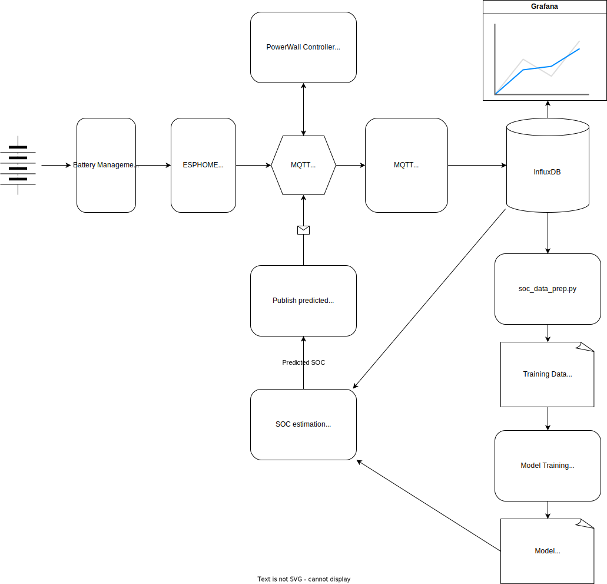

# LFP battery SOC prediction ML project

The main objective of the project is to obtain an accurate State of Charge (SOC) for a Lithium Iron Phosphate (LiFePO4 or LFP) battery.


Maintaining the State of Charge (SOC) within recommended levels is crucial for Lithium Iron Phosphate (LFP) batteries for several reasons:

- Battery Longevity: Proper SOC management extends the lifespan of LFP batteries by reducing stress on cells and minimizing degradation.

- Safety: Monitoring SOC prevents overcharging and over-discharging, ensuring a safe operating environment and preventing hazards.

- Performance Optimization: SOC directly influences energy capacity, ensuring consistent and reliable power output for specific application requirements.

- Efficiency: Optimal SOC levels enhance battery system efficiency, minimizing energy losses and maximizing usable energy.

- Reliability: Consistent SOC management enhances the reliability of LFP batteries, providing users with a stable and predictable energy supply.

Additionally, an accurate State of Charge (SOC) level is essential for Solar Photovoltaic (PV) systems. It helps maintain the battery at a certain level to maximize the next day's PV utilization.

# System Architecture



# The main idea behind the solution and reasoning

The Coulomb counting (current integration) method provides accurate State of Charge (SOC) results when equipped with a properly calibrated current sensor and periodic synchronization with 100% SOC. However, it is susceptible to cumulative errors, particularly during extended periods when the battery is not fully charged.

Here is an example of corrected and raw Coulomb counting from the Battery Management System (BMS):


To address cumulative errors in Coulomb counting, a potential solution is to use a prediction mechanism using neural networks or other machine learning models. This approach can help correct errors and enhance the overall accuracy of SOC estimation, mitigating the impact of extended periods without full battery charging.

# Data collection

The data has been collected from a home installation battery system using a battery management system (BMS).

The system features a 14 kWh Lithium Iron Phosphate (LFP) battery with an 8s2p configuration, consisting of 16 EVE 280k cells.

Various metrics from the BMS have been stored in InfluxDB over several weeks, allowing for comprehensive monitoring and analysis.

```
 #   Column
---  ------
 0   bms_state_of_charge
 1   bms_capacity_remaining
 2   bms_average_cell_voltage
 3   bms_delta_cell_voltage
 4   bms_current
 5   bms_temperature_2
 6   bms_cell_voltage_1
 7   bms_cell_voltage_2
 8   bms_cell_voltage_3
 9   bms_cell_voltage_4
 10  bms_cell_voltage_5
 11  bms_cell_voltage_6
 12  bms_cell_voltage_7
 13  bms_cell_voltage_8
```

See additional details in `soc_data_prep.py`, the prepared data is in the `/data` folder.

# Data exploration and modeling

All steps are covered in Jupyter notebook file: [notebooks/soc_exploration.ipynb](https://github.com/alexdatadesign/lfp_soc_ml/blob/main/notebooks/soc_exploration.ipynb)


In general, we are predicting the current SOC value based on the past 15 minutes of BMS data. So, partially, it's a time series problem involving current battery state measurements. XGBoost has been used for modeling, along with some feature engineering.

The target variable is a SOC value that will be used for correcting SOC values calculated by the Coulomb counting method.

Feel free to explore the notebook and contribute to further analysis or improvements.

# Results


The root mean square error (RMSE) is about 0.15. The model, in general, demonstrates greater accuracy in non-flat regions of the battery charge curve.

It's important to acknowledge and consider this characteristic when interpreting the model's results and assessing its strengths and limitations.

# Deployment for Production and Experimentation

The data will be needed for model training and inference.

Here is the steps to deploy system in production:

- You will need a runninig x86 small server like Intel NUC or similar with Ubuntu installation
- Install InfluxDB for data collection, the official guide is [here](https://docs.influxdata.com/influxdb/v1/introduction/install/)
- Create an InfluxDB database
- Install Mosquitto MQTT broker for IoT data messaging; [find the guide here](https://linux.how2shout.com/how-to-install-mosquitto-in-ubuntu-22-04-or-20-04-lts/)
- Publish the BMS raw data into MQTT; we used [JBD-BMS ESPHOME WiFi bridge](https://github.com/syssi/esphome-jbd-bms) to collect data every 2 seconds
- Clone the repository
- Create a Python virtual enviroment `python3 -m venv venv; source venv/bin/activate`
- Install requirements using `pip -r requirements.txt`
- Modify and run [mqtt2influxdb.py MQTT to InfluxDB bridge](https://github.com/alexdatadesign/lfp_soc_ml/mqtt2influxdb/mqtt2influxdb.py)
- Optionally, you can [install Grafana](https://grafana.com/docs/grafana/latest/setup-grafana/installation/debian/) to visualize metrics over time
- You will need a few full battery charge/discharge cycles to obtain data for training
- Prepare data by running `soc_data_prep.py`
- Train the model with `soc_train.py`; the model will be saved in `soc_model.json`.
- Use `soc_predict.py` to obtain the currently predicted SOC value.


# Future work and improvements

It's possible to implement an inference part on a smaller microcontroller (MCU) such as ESP32 or Raspberry Pi Zero.

Data collection from multiple batteries systems will add to the model accuracy and robustness.

This might be implemented as a centralized data collection in the cloud.

# References and additional information

- [The State of Charge Estimating Methods for Battery: A Review](https://www.hindawi.com/journals/isrn/2013/953792/)
- [ESPHOME BMS Integration componets, a lot of BMS supported](https://github.com/syssi?tab=repositories)
- [EVE LF280K cell product specification](https://www.imrbatteries.com/content/eve_LF280K.pdf)
