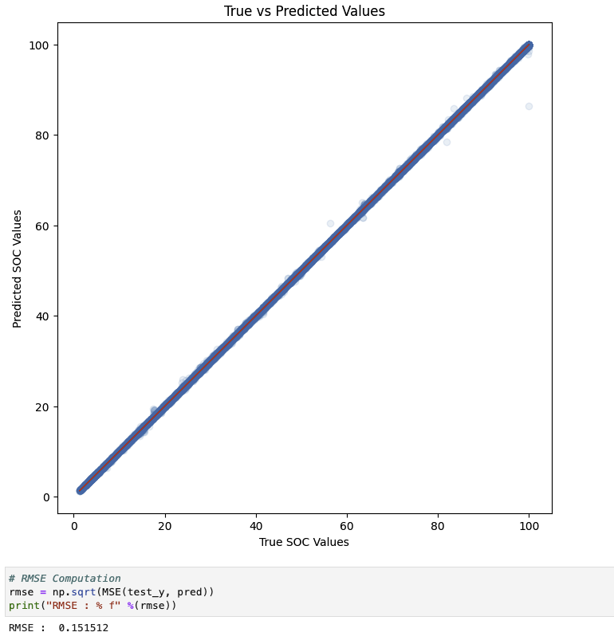

# LFP battery SOC prediction ML project

The main objective of the project is to obtain an accurate State of Charge (SOC) for a Lithium Iron Phosphate (LiFePO4 or LFP) battery.


Maintaining the State of Charge (SOC) within recommended levels is crucial for Lithium Iron Phosphate (LFP) batteries for several reasons:

- Battery Longevity: Proper SOC management extends the lifespan of LFP batteries by reducing stress on cells and minimizing degradation.

- Safety: Monitoring SOC prevents overcharging and over-discharging, ensuring a safe operating environment and preventing hazards.

- Performance Optimization: SOC directly influences energy capacity, ensuring consistent and reliable power output for specific application requirements.

- Efficiency: Optimal SOC levels enhance battery system efficiency, minimizing energy losses and maximizing usable energy.

- Reliability: Consistent SOC management enhances the reliability of LFP batteries, providing users with a stable and predictable energy supply.

Additionally, an accurate State of Charge (SOC) level is essential for Solar Photovoltaic (PV) systems. It helps maintain the battery at a certain level to maximize the next day's PV utilization.

# The main idea behind solution and reasoning

Coulomb counting (current integration) method gives an accurate result for SOC when we have properly calibrated current sensor and periodic synchoronization with 100% SOC. But it suffers from cumulative error over the time especially when battery is not fully charged over the long period.

[example graph]

To remedy cumulative error in coulomb counting we can correct this error by the prediction provided with neural network or other machine learning model.

# Data collection

The data has been collected from a home installation battery system using a battery management system (BMS).

The system features a 14 kWh Lithium Iron Phosphate (LFP) battery with an 8s2p configuration, consisting of 16 EVE 280 kWh cells.

We stored the following metrics from BMS for several weeks in InfluxDB:

```
 #   Column
---  ------
 0   bms_state_of_charge
 1   bms_capacity_remaining
 2   bms_average_cell_voltage
 3   bms_delta_cell_voltage
 4   bms_current
 5   bms_temperature_2
 6   bms_cell_voltage_1
 7   bms_cell_voltage_2
 8   bms_cell_voltage_3
 9   bms_cell_voltage_4
 10  bms_cell_voltage_5
 11  bms_cell_voltage_6
 12  bms_cell_voltage_7
 13  bms_cell_voltage_8
```

See additional details in `soc_data_prep.py`, the prepared data is in the `/data` folder.

# Data exploration and modeling

All steps are covered in Jupyter notebook file: `notebooks/soc_exploration.ipynb`

XGBoost has been used for modeling with some feature engineering.

The target variable is a SOC value shall be used for SOC value correction calculated by coulomb counting method.

Feel free to explore and contribute.

# Results


